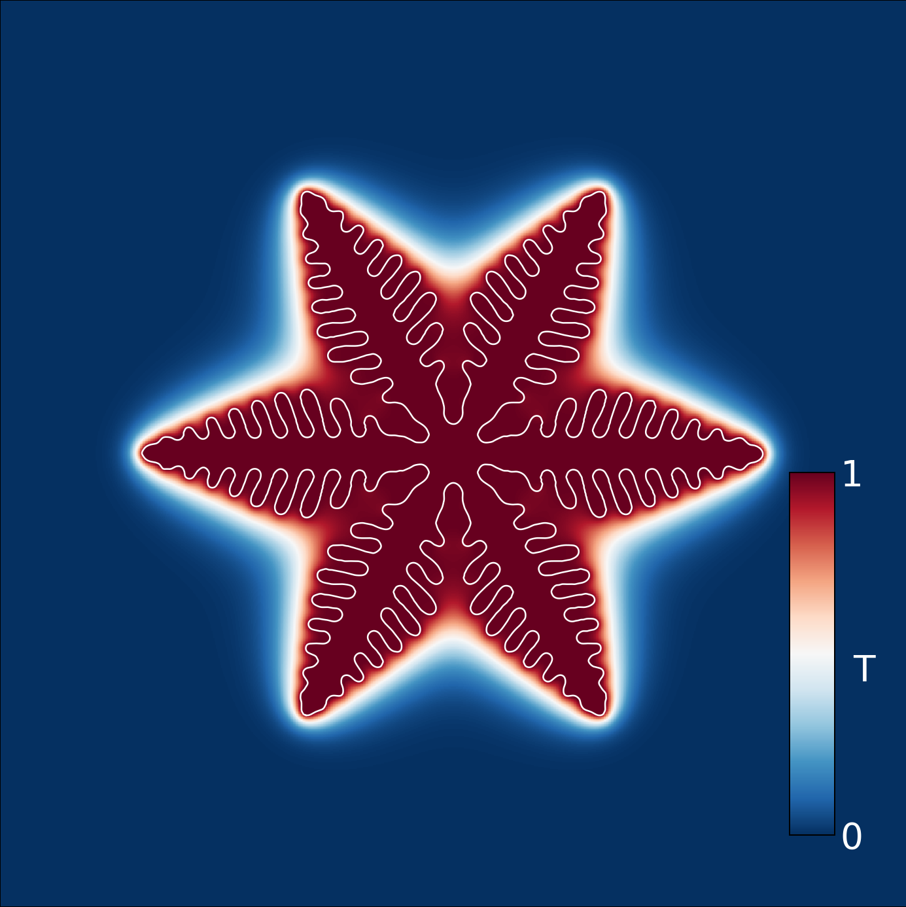
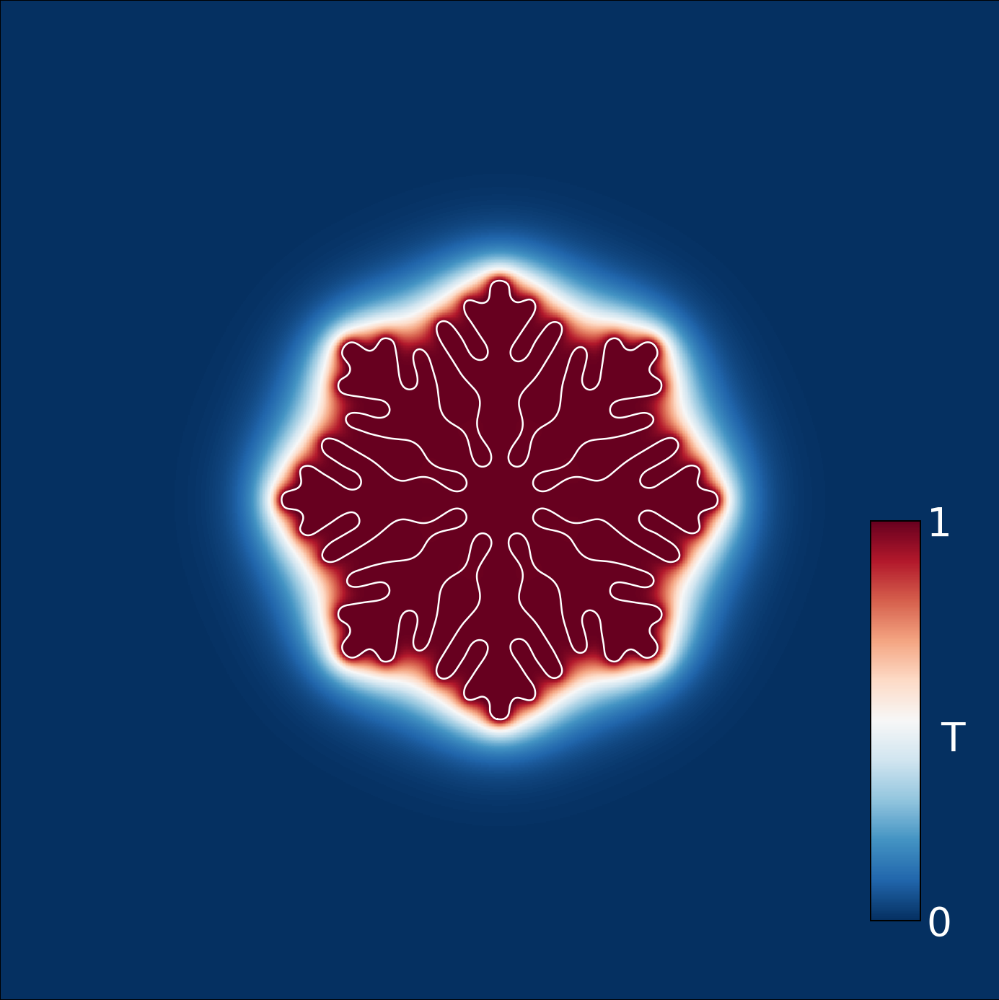
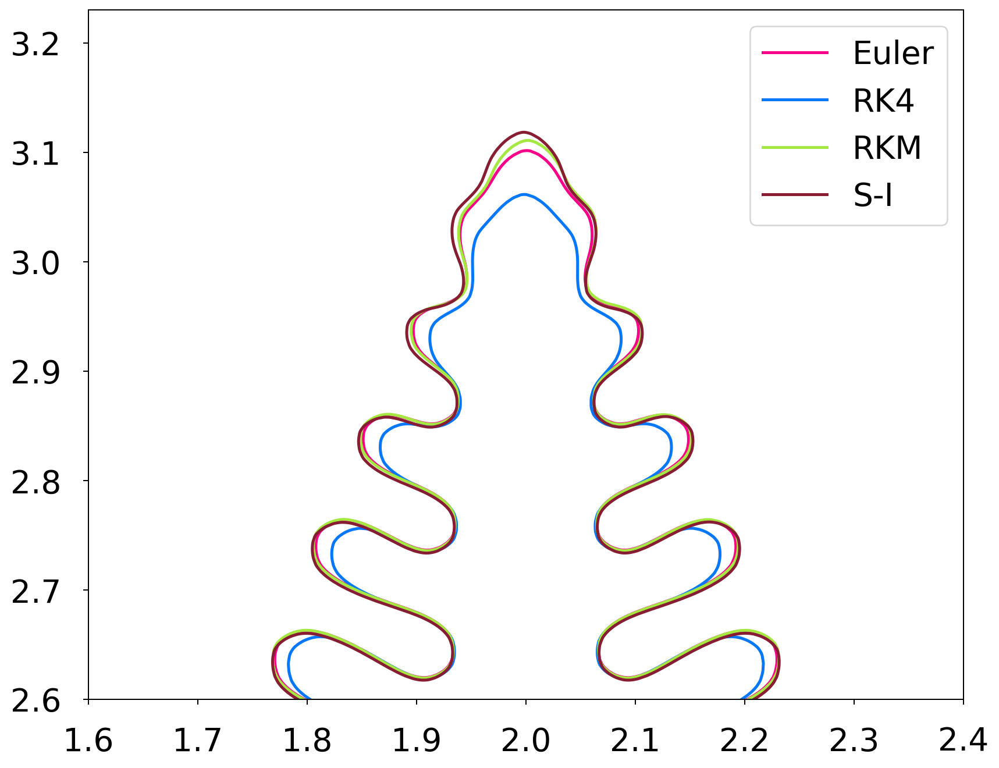
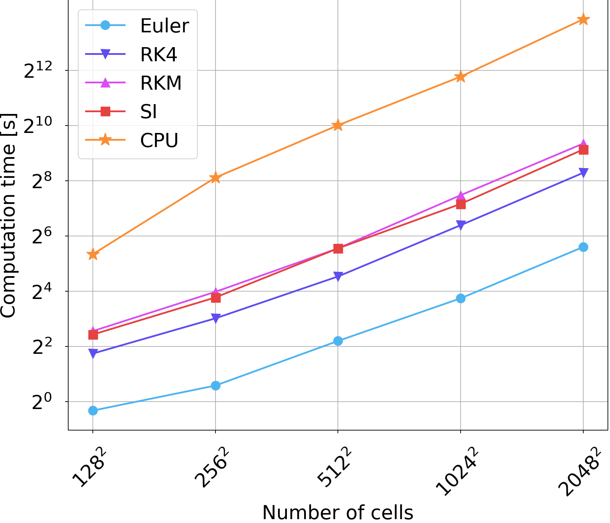

The source code to my bachelors thesis at CTU in Prague, Faculty of Nuclear Sciences and Physical Engineering supervised by Ing. Pavel Strachota, Ph.D. For the details/documentation etc. refer to the full text in Bachlelors.pdf or the latex source.

# Abstract
This work is concerned with GPU parallel implementation of numerical schemes of the
two dimensional phase field model, describing crystal growth in undercooled media. Firstly, the
phase field model is introduced and the finite volume method is utilized to derive a semi-discrete
scheme for admissible meshes. This scheme is numerically integrated using higher order explicit
methods. Then, a semi-implicit time integration scheme is derived using the Crank-Nicolson
method and solved using the conjugate gradient method. Two approaches to reduce the error
introduced by the operator splitting method are presented and later compared. Programming
with CUDA is thoroughly introduced and several optimized algorithms required by the simulation
implementation are explained. The efficiency of one of the described algorithms is shown in a
benchmark. Finally, simulation results of the proposed time integration schemes are compared
and good agreement with previous results is shown.

# Gallery 

| Crystal with 6-fold anisotropy | Crystal with 8-fold anisotropy |
|--------------------------------|--------------------------------|
|  |  |

The simulated crystal structures. Images show the crystal outline in white and temperature field gradient. The solid crystal is the hottest and the surrounding undercooled (under freezing temperature) liquid the coldest.  

| Comparison of various different time integration schemes | Benchmark comparison vs reference CPU implementation showing up to 20x time speedup on laptop GPU |
|--------------------------------|--------------------------------|
|  |  |

# Conclusion

This work presents the derivation of several numerical schemes for solving the two dimen-
sional phase field problem with a simple anisotropy, together with its GPU parallel implemen-
tation showing good performance on consumer hardware. The finite volume method notation is
introduced and utilized to derive approximations for the Laplacian and gradient differential oper-
ators on admissible meshes. Different boundary conditions are described within the finite volume
framework using ghost cells. Semi-discrete scheme of the phase field model is derived. Then ex-
plicit time integration schemes such as the explict Euler and Runge-Kutta-Merson methos are
discussed and a time integration algorithm is presented. Semi-implicit time integration scheme
utilizing the Crank-Nicolson method is derived. Solution of the resulting matrix of equations is
discussed and operator splitting method is utilized to aid numerical matrix solvers and enabling
the conjugate gradient method to be used. Internal error introduced by the operator splitting
method is quantified and two techniques are provided for its reduction. The first is the repeated
iteration technique, which has been shown to reliably reduce the operator splitting error. The
second is the correction term technique, which has failed to reduce the operator splitting er-
ror, but produces similar crystal structures to the repeated iteration technique at no additional
runtime cost.

Next, a detailed introduction to the CUDA hardware and programming model is given. Even
though the text starts with simple examples, it quickly reaches non-trivial optimized implemen-
tations of the parallel for, parallel tiled for and parallel reduction algorithms. Special focus is put
on shared memory with relation to the CUDA programming model and optimization of memory
intensive kernels. A state-of-the-art parallel reduction kernel is presented, utilizing warp-level
parallelism. Benchmarks of the presented algorithms are performed, showcasing superior perfor-
mance on small and large datasets compared to the CUDA Thrust library.

Finally, simulation results of the proposed time integration schemes are shown. A discussion
of boundary conditions and their impact on the simulation is given. Integration schemes are
compared, showcasing consistency between the different techniques. The runtime performance
of the developed simulation code is compared against a reference implementation. Speedups
upwards of 20 times can be observed on both consumer hardware and specialized HPC hardware.
The developed simulation code is freely available at https://github.com/Boostibot/bachelors.

Further work is needed to extend the proposed algorithms to three dimensions and efficiently
distribute the simulation workload in many GPU setups, enabling simulation on high resolution
three dimensional meshes. The parallel algorithms developed in this work can be used with
advantage to solve more complex models including, for example, phase transitions in alloys,
solidification subject to fluid flow, or freezing and thawing in porous media.
